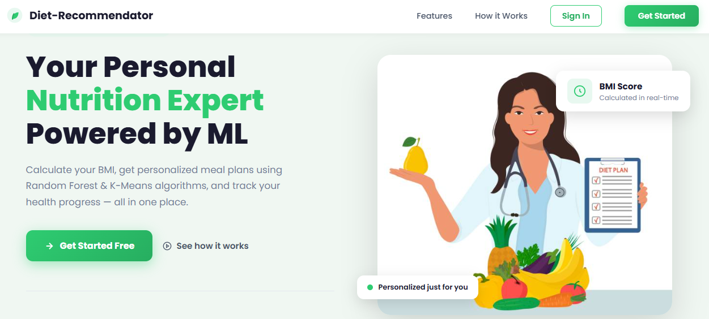
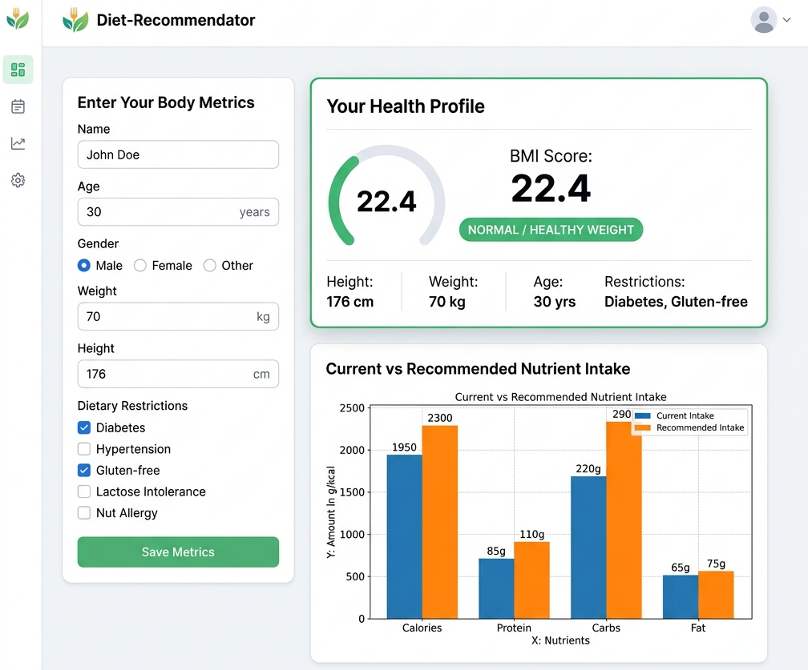
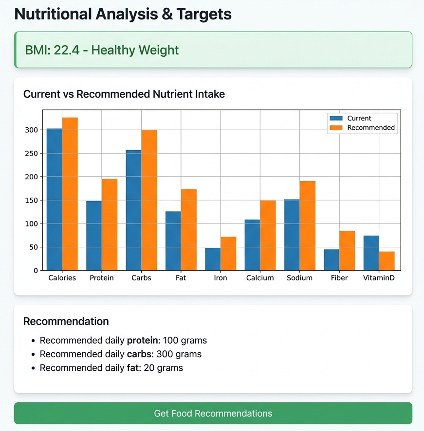
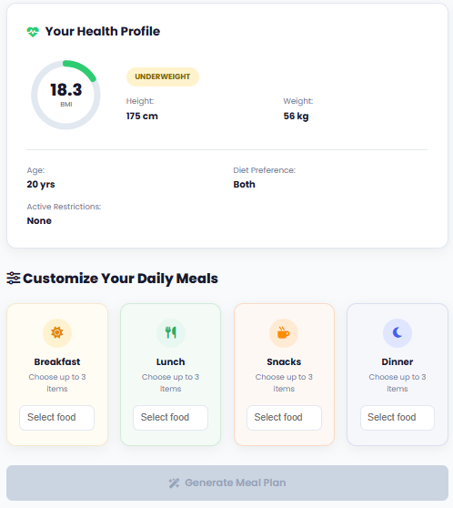
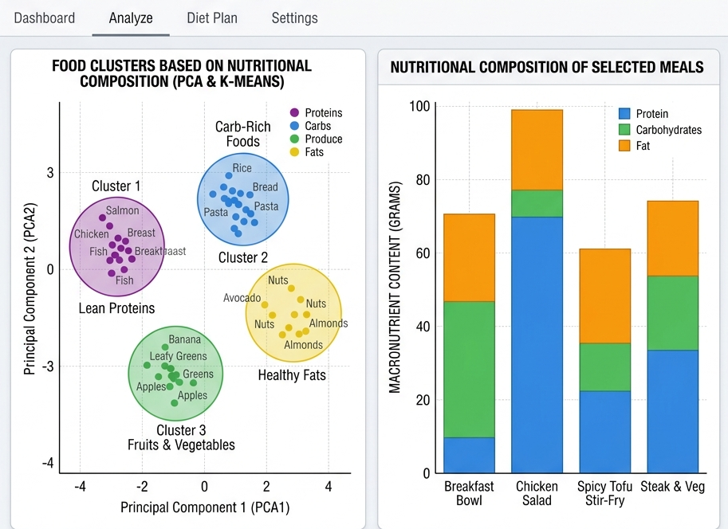
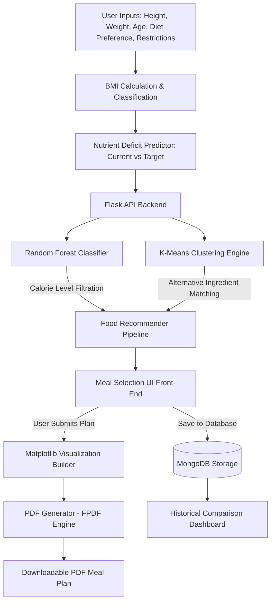

<div align="center">



# 🥗 Diet-Recommendator — ML-Powered Diet Recommendation System

**A smart, data-driven diet recommendation system that analyzes health metrics, classifies caloric requirements, clusters nutrient-similar foods, and outputs personalized PDF meal plans.**

[](https://www.python.org/)
[](https://flask.palletsprojects.com/)
[](https://scikit-learn.org/)
[](https://www.mongodb.com/)
[](https://pyfpdf.github.io/fpdf2/)

</div>

---

## 📖 Table of Contents
- [🎯 Project Overview](#-project-overview)
- [✨ Core Features](#-core-features)
- [🖼️ Application Walkthrough](#️-application-walkthrough)
- [⚙️ System Architecture](#️-system-architecture)
- [🤖 Machine Learning Pipeline](#-machine-learning-pipeline)
- [📊 Dataset Specification](#-dataset-specification)
- [🛠️ Tech Stack](#️-tech-stack)
- [🚀 Local Setup & Installation](#-local-setup--installation)
- [📂 Directory Structure](#-directory-structure)
- [👥 Authors & Guide](#-authors--guide)

---

## 🎯 Project Overview

Managing daily nutrition and choosing appropriate meal plans tailored to specific body metrics (BMI) and health conditions (like Diabetes or Lactose Intolerance) is complex. **Diet-Recommendator** automates this by utilizing machine learning models to analyze user metrics and recommend balanced meals.

The application calculates a user's BMI, models their current nutrition deficit, classifies foods using a **Random Forest Classifier**, and performs alternative nutrient matching using **K-Means Clustering**. Users can construct their meal plan dynamically, view live charts, download a comprehensive PDF report, and track their historical health progress.

---

## ✨ Core Features

*   **🔒 Secure User Accounts**: Fully operational authentication (Sign Up / Sign In) using hashed password verification, connected to a MongoDB backend.
*   **⚖️ BMI & Health Profiling**: Accurate Body Mass Index calculation and weight classification (Severely Underweight, Underweight, Healthy, Overweight, Severely Overweight).
*   **📊 Nutrient Deficit Modeler**: Predicts current nutrient intake and targets based on BMI and diet preferences (Vegetarian, Non-Vegetarian, Both).
*   **🛡️ Medical & Dietary Filter Options**: Supports filtering based on clinical conditions and allergies, including:
    *   *Diabetes Friendly* (low sugar/balanced carbs)
    *   *Hypertension* (low sodium)
    *   *Celiac Disease* (gluten-free)
    *   *Lactose Intolerance* (dairy-free)
    *   *Nut Allergies* (nut-free)
*   **🤖 Supervised Caloric Classification**: Employs a **Random Forest Classifier** to bucket foods into matching caloric levels dynamically based on BMI guidelines.
*   **🧩 Unsupervised Nutrient Clustering**: Employs **K-Means Clustering** and **PCA (Principal Component Analysis)** to discover nutrient-similar alternative options if specific food types are unavailable or restricted.
*   **🥗 Interactive Meal Planner**: Dynamic selection of Breakfast, Lunch, Snack, and Dinner (maximum of 3 items per meal) with live Select2 tag dropdown search.
*   **📈 Graphical Visualizations**: In-browser rendering of:
    1.  *Current vs. Target Intake* comparison bar chart.
    2.  *Food Database Clusters* scatter plot in reduced 2D PCA space.
    3.  *Stacked Nutritional Composition* breakdown of the formulated meal plan.
*   **📄 PDF Report Generator**: Generates clean, downloadable PDF files containing the personalized meal plan, nutrient targets, and visual plots.
*   **🔄 Historical Progress Tracker**: Saves user reports in MongoDB, allowing users to select and compare previous reports to observe weight and nutrient intake trends over time.

---

## 🖼️ Application Walkthrough

### 1. User Dashboard & Metric Inputs
Users enter their name, age, gender, diet type, weight, height, and medical conditions to start the nutrient profiling engine.


### 2. Nutritional Analysis & Targets
The system displays computed BMI indicators alongside recommended daily goals for Calories, Protein, Carbs, and Fats.


### 3. Smart Meal Planner Selector
Using filtered lists, users select exact ingredients to build their meal plan.


### 4. Advanced Machine Learning Visuals
Visualize the underlying dataset's K-Means cluster grouping (PCA-reduced) and the selected meal composition.


---

## ⚙️ System Architecture

The following flowchart illustrates the end-to-end data processing and model orchestration pipeline:



---

## 🤖 Machine Learning Pipeline

### 1. Supervised Learning: Random Forest Classifier
*   **Purpose**: Predict the "Calorie Level" rating (0-4) of food items.
*   **Feature Columns (X)**: `Calories`, `Protein`, `Carbs`, `Fat`.
*   **Target Labels (Y)**: Generated programmatically using quantile binning (`pd.qcut()`) based on the distribution of Calories in the dataset.
*   **Implementation**: A Random Forest Ensemble Classifier (100 estimators) splits the nutrition matrix, learns boundaries, and labels all foods to prevent caloric mismatching (e.g. recommending high-calorie items to overweight categories or low-calorie items to underweight categories).

### 2. Unsupervised Learning: K-Means Clustering
*   **Purpose**: Groups food items into 5 categories based on nutritional profiles.
*   **Features Used**: Standardized `Calories`, `Protein`, `Carbs`, and `Fat` columns.
*   **Scaling**: Features are normalized using `StandardScaler` to bring them onto the same scale (essential for distance-based clustering).
*   **Fall-back Logic**: If the initial calorie filters result in less than 8 meal options due to strict user medical restrictions, the recommender expands options by finding other food items within the same K-Means cluster, guaranteeing nutrient-adequate suggestions.

### 3. Dimensionality Reduction: PCA (Principal Component Analysis)
*   **Purpose**: Compression of a 4-dimensional nutrient space (Calories, Protein, Carbs, Fat) into a 2-dimensional space ($PCA_1$ and $PCA_2$) to plot food distributions.
*   **Visual Output**: Standard 2D Matplotlib scatter plot with Viridis color-coding representing the K-Means clusters.

---

## 📊 Dataset Specification

The application uses `food.csv` which contains comprehensive nutritional details and boolean flags:

| Column Name | Data Type | Description |
| :--- | :--- | :--- |
| `Food_items` | String | Name of the food item |
| `Calories`, `Protein`, `Carbs`, `Fat` | Float | Primary macronutrients per serving |
| `Vegetarian`, `Non_Vegetarian` | Binary (0/1) | Diet preference classification |
| `Diabetes_Friendly`, `Low_Sodium` | Binary (0/1) | Clinical suitability flags |
| `Gluten_Free`, `Lactose_Free`, `Nut_Free`| Binary (0/1) | Allergen safety indices |
| `Meal_Type` | String | Suitable time (Breakfast, Lunch, Snack, Dinner) |

---

## 🛠️ Tech Stack

*   **Backend**: Python 3.8+, Flask, MongoDB (PyMongo)
*   **Frontend**: HTML5, Vanilla CSS3 (custom layouts & responsive viewports), jQuery, Select2
*   **Machine Learning**: Scikit-Learn (Random Forest, KMeans, PCA), Pandas, NumPy, StandardScaler
*   **Plotting/Graphics**: Matplotlib (Agg backend configuration for server thread-safety)
*   **Document Generation**: FPDF2 PDF exporter engine

---

## 🚀 Local Setup & Installation

Follow these steps to run the application locally:

### 1. Prerequisites
Make sure you have [Python 3.8+](https://www.python.org/downloads/) and [MongoDB Community Server](https://www.mongodb.com/try/download/community) installed and running on your machine.

### 2. Clone the Repository
```bash
git clone https://github.com/aryanraj71/Diet-Recommendation-System.git
cd Diet-Recommendation-System
```

### 3. Create a Virtual Environment & Install Dependencies
```bash
# Create virtual environment
python -m venv venv

# Activate virtual environment
# On Windows:
venv\Scripts\activate
# On macOS/Linux:
source venv/bin/activate

# Install required libraries
pip install -r requirements.txt
```
*(Note: If requirements.txt is empty, install packages manually:* `pip install flask pandas numpy scikit-learn matplotlib pymongo fpdf`*)*

### 4. Verify MongoDB is Running
Make sure the local MongoDB instance is running on the default port:
```bash
# Windows Command Prompt:
net start MongoDB
# Linux/macOS:
sudo systemctl status mongod
```

### 5. Launch the Application
```bash
python app.py
```
Open your browser and navigate to: **`http://localhost:5000`**

---

## 📂 Directory Structure

```directory
Diet-Recommendation-System/
├── app.py                     # Main Flask Server & Machine Learning Models
├── food.csv                   # Food items nutritional dataset
├── requirements.txt           # Python dependency manifest
├── .gitignore                 # Version control file exclusions
├── docs/                      
│   └── images/                # Visual UI assets and diagrams
│       ├── banner.png
│       ├── dashboard.png
│       ├── analysis.png
│       ├── recommendations.png
│       └── architecture.png
├── static/                    # Static UI elements
│   ├── login-bg.jpg           # Background layout
│   ├── logo.png               # Brand icon
│   └── nutrition.jpg          # Welcome card cover
└── templates/                 # UI HTML templates
    ├── front.html             # Landing portal
    ├── login.html             # User login portal
    ├── signup.html            # Registration portal
    └── index.html             # Main Dashboard & Results screen
```

---
